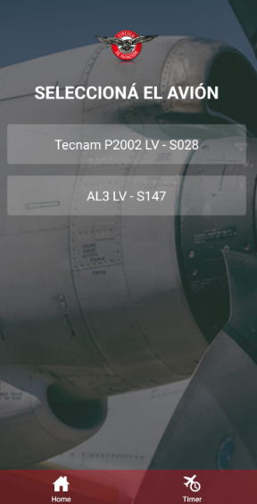
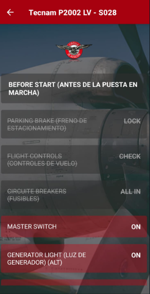

# Preflight Checklist App

## Descripción

La **Preflight Checklist App** es una aplicación móvil diseñada para ayudar a los pilotos a gestionar la lista de tareas previas al vuelo. La app permite seleccionar los aviones a volar y contar con un temporizador que indica el tiempo restante de vuelo y el intervalo para cambiar el tanque de combustible. Además, la app emite una alarma cuando es el momento de realizar el cambio de tanque de combustible, lo que ayuda a mantener la seguridad y eficiencia en los vuelos.

## Características

- **Selección de aviones**: Permite elegir entre diferentes aviones disponibles para el vuelo.
- **Temporizador de vuelo**: Muestra un temporizador que cuenta las horas de vuelo, ajustable según el tiempo de vuelo estimado.
- **Intervalo de cambio de tanque**: Establece el intervalo en minutos para recordar al piloto cuándo cambiar el tanque de combustible.
- **Alarma de cambio de tanque**: La app emite una alarma cuando es el momento de realizar el cambio de tanque.
- **Reinicio del temporizador**: Se puede reiniciar el temporizador de vuelo en cualquier momento.
- **Interfaz intuitiva**: Diseño de interfaz sencilla y clara para un uso fácil y rápido durante el vuelo.






## Get started

1. Install dependencies

   ```bash
   npm install
   ```

2. Start the app

   ```bash
    npx expo start
   ```

In the output, you'll find options to open the app in a

- [development build](https://docs.expo.dev/develop/development-builds/introduction/)
- [Android emulator](https://docs.expo.dev/workflow/android-studio-emulator/)
- [iOS simulator](https://docs.expo.dev/workflow/ios-simulator/)
- [Expo Go](https://expo.dev/go), a limited sandbox for trying out app development with Expo

You can start developing by editing the files inside the **app** directory. This project uses [file-based routing](https://docs.expo.dev/router/introduction).

## Get a fresh project

When you're ready, run:

```bash
npm run reset-project
```

This command will move the starter code to the **app-example** directory and create a blank **app** directory where you can start developing.

## Learn more

To learn more about developing your project with Expo, look at the following resources:

- [Expo documentation](https://docs.expo.dev/): Learn fundamentals, or go into advanced topics with our [guides](https://docs.expo.dev/guides).
- [Learn Expo tutorial](https://docs.expo.dev/tutorial/introduction/): Follow a step-by-step tutorial where you'll create a project that runs on Android, iOS, and the web.

## Join the community

Join our community of developers creating universal apps.

- [Expo on GitHub](https://github.com/expo/expo): View our open source platform and contribute.
- [Discord community](https://chat.expo.dev): Chat with Expo users and ask questions.
# PreFlight-Checklist
